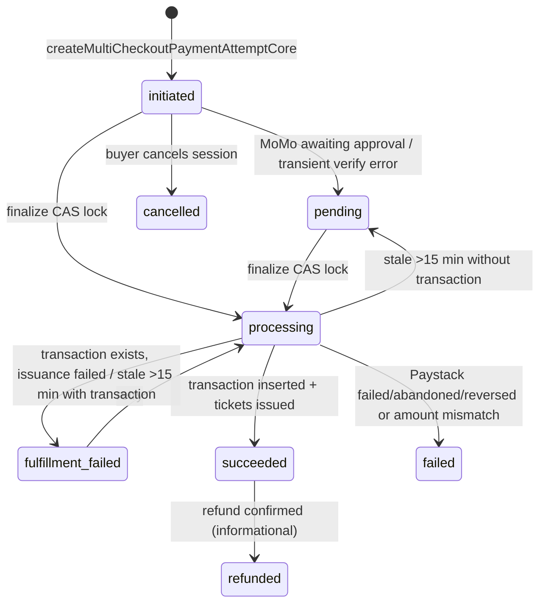

# Money-path state machines

Statuses are `text` columns with CHECK constraints (there are **no Postgres enums** in this schema). Values below are copied from the constraints.

## `ticket_checkout.status`

`pending → paid` (by `issue_tickets_for_checkout`) · `pending → expired` (by `expire_stale_ticket_checkouts`, unless a live attempt exists) · `pending → cancelled` (buyer cancels the session, `cancelTicketCheckoutSessionCore`) · `pending → failed` (payment terminal failure). `paid` is terminal; a cancelled ticket does not change its checkout row.

## `payment_attempt.status`

Only `initiated`, `pending` and `fulfillment_failed` can be locked into `processing`; this is the guard that makes client-verify and the webhook race safely.

## `transaction.status`

`successful` (inserted on verify) → `refund_pending` (refund requested, `record_refund_hold`) → `refunded` (webhook `refund.processed`, `record_refund_release`) · `refund_pending → successful` with `refund_requested_at` set (webhook `refund.failed` — the UI shows "Refund failed" and a Retry refund button). `pending` and `failed` exist for legacy rows. `paystack_reference` is UNIQUE — the idempotency key of the whole path.

## `ticket.status`

`active → used` (check-in, `checkInTicketCore`; reversible by the organizer) · `active → cancelled` (buyer `cancelUserTicketCore`, or `cancel_event_and_release_tickets`) · `active → expired` (event passed). `attendance.status`: `attending → cancelled`.

## `payout.status` and review

`processing` (created by `request_organizer_payout` or `admin_create_payout`; a `payout_hold` ledger entry of −amount is written) → `completed` (`admin_settle_payout`, hold kept — money left) · → `failed` / `cancelled` (`admin_settle_payout`, one `payout_release` entry of +amount returns the balance). Terminal states never move again.

`payout.review_status`: `none` · `required` (set by `payout_guard_review` when > 20% of an event's sales were credit-funded or a dispute is open) · `cleared` (`admin_clear_payout_review`, `finance.payout` + step-up).

`payout.transfer_status` (Paystack Transfers, flag off): `none → pending` (`sendPayoutAdminCore`) → `success` / `failed` / `reversed` (webhook → `admin_settle_payout`).

## `organizer_ledger_entry.entry_type`

`earning` (+ticket price, at issuance) · `refund_hold` (−, at refund request) · `refund_release` (+, if the refund fails) · `payout_hold` (−) · `payout_release` (+) · `promoter_commission` (−, when a promoter reward is released) · `promoter_commission_reversal` (+). Pre-2026-08-30 `earning` rows carry a historical 2% `fee_amount`; newer rows have `fee_amount = 0`. Available balance = Σ settled `earning` + Σ refund entries + Σ payout entries + Σ commission entries, where settled means `is_event_settled(event_id)` (48 h after the last occurrence ends).

## `platform_fee_entry.entry_type`

`fee` (ticket_revenue, service_fee, total_customer_payment, processing_cost or NULL, net_revenue) · `fee_refund_adjustment` (ticket_revenue negative; fee kept). One `fee` row per transaction (`platform_fee_entry_fee_once`).

## Credit (Abonten Rewards)

- `credit_account.status`: `active` · `frozen` (`credit_set_account_status`, `rewards.freeze`) · `closed` (`credit_close_account`, on account deletion).
- `credit_reservation.status`: `reserved` (at payment start, `credit_reserve`) → `captured` (`credit_capture_reservation` on confirmed payment) · → `released` (`credit_release_reservation` on failure, or `credit_release_stale_reservations`).
- `credit_adjustment_request.status`: `pending` (≥ GH₵ 500 needs a second admin) → `executed` · `rejected` · `cancelled`.
- `reward_event.status`: `pending` → `held` (review) → `released` · `rejected` · `voided` · `deferred` · `clawed_back`. Risk flags decide `auto` / `review` / `reject` (`riskScore.ts`, thresholds 30/70).
- `notification_delivery.status`: `queued → sending → sent | skipped | failed`.

## Field-programme money

- `fieldops_commission.status`: `pending` (at lead verification, rule frozen) → `approved` (sweep) → `in_payout` (batch built) → `paid` (item marked paid) · `rejected` (sweep hard failure or admin) · `reversed` (before payment). A **paid** commission is never edited; a reversal adds a negative offset row. No DELETE grant exists, even for `service_role`.
- `fieldops_payout_batch.status`: `draft → approved` (a different admin than the creator — DB CHECK) `→ paid` · `cancelled` (only if nobody was paid). `fieldops_payout_item.status`: `pending → paid` (reference required) · `→ failed` (reason required; commissions return to `approved`).

## Inconsistent combinations (reconciliation flags these)

| Combination | Meaning | Where it shows |
|---|---|---|
| `ticket_checkout=paid` with no `earning` entry | issuance succeeded without ledger | `run_financial_reconciliation` incident |
| `payment_attempt=succeeded` with no `ticket` | fulfilment gap | incident |
| `payment_attempt=processing` older than 1 h | reaper stopped | incident |
| `transaction=refund_pending` older than several days | Paystack never confirmed | manual check in Finance › Refunds; check Paystack dashboard |
| `payout=processing` with `review_status=required` | waiting for finance | Finance › Payouts |
| `credit_reservation=reserved` past `expires_at` + 2 h | stuck tender | rewards incident ("Credit reservations need attention") |
| `fieldops_onboarding=succeeded` without exactly one live commission | ledger gap | `run_financial_reconciliation` field-ops invariant, `fieldops_health()` |
