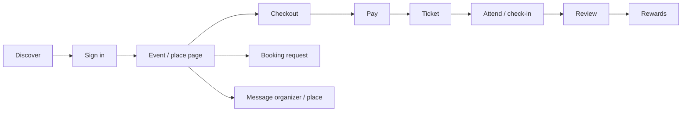

# Customer journey

| Stage | User does (W/A) | System | Failure points | Docs |
|---|---|---|---|---|
| **Discover** | Chooses a location, browses Home/Explore/Events/Places, searches, uses the map, filters (W, A) | Discovery RPCs (`get_filtered_events`, `get_nearby_*`, `get_filtered_places`, `get_similar_events`), unified search (`search_suggest`, `search_events`, `search_places`, `search_organizers`) when the Discovery programme is on for them, moderation filter; `country`/`NEXT_LOCALE` cookies; `abn_ref` if arriving from a share/invite link | Not appearing (unpublished/hidden/stale matview); map key | Help: finding-events-and-places; troubleshooting |
| **Sign in** | Google / phone OTP / email OTP; consent line shown (W, A); invite code applied | Supabase Auth; Hubtel; `phone_otp_state`; `user_info` created by trigger; referral bind (`referral_bind`) | No code, rate limits, Google redirect | Help: getting-started; security/application-security |
| **Event or place page** | Reads details, saves, shares, sets a reminder (A), messages | `favorite*`, `event_share` + referral touch, local reminders, `open_conversation` | — | Help pages |
| **Booking request** (place) | Sends request; tracks under Bookings | `place_booking` pending → owner accepts/declines; notifications | Owner unresponsive | Help: bookings |
| **Checkout** | Picks date/type/quantity, promo code; 30-min hold; basket resume | `validateCheckoutCore` → `create_ticket_checkout`; limits 50/100; promo lookup rate limit | Sold out, hold expiry, existing checkout | Help: tickets-and-checkout; finance runbook |
| **Pay** | Card popup / saved method / MoMo OTP; optional Abonten Credit | `payment_attempt` → Paystack → `finalizePaystackPayment` (client verify + webhook) → `transaction` → `issue_tickets_for_checkout` → fee entry | Declined, provider outage, paid-no-ticket → Retry | finance runbook §6; support scenario 1 |
| **Ticket** | My Tickets / Tickets tab; QR; PDF; email | `ticket`, QR on Cloudinary, Resend email, notification + push | Email missing → Resend | Help: your-tickets |
| **Cancel / refund** | Cancels active ticket | `cancelUserTicketCore` → `issueRefundCore` (ticket price, fee retained) → `refund_pending` → webhook → `refunded` | Refund failed → Retry refund | Help: refunds-and-cancellations; finance refunds |
| **Attend** | Shows QR; organizer scans (A) or checks in from list | `checkInTicketCore` → `used` | Already used (shared QR) | Help: your-tickets; organizer event-day |
| **Review** | After the event, if checked in: rating, title, comment, photos | `eventReviewEligibility`; `event_review` (+ photos); organizer reply | Not eligible | Help: reviews-and-highlights |
| **Rewards** (when live) | Invites friends, shares events, sees credit, spends credit at checkout | Referral engine, credit ledger, risk scoring; today: shadow mode | Not available yet | Help: rewards-and-credit; rewards operations |
| **Account** | Profile, security (phone/email), language, appearance, notifications, delete account | `user_info`, Auth, `notification_preference`; `deleteAccountCore` | Restricted account | Help: account/* |

Privacy touchpoints along the journey: location permission, device/browser id for fraud signals, ticket emails, organizer sees attendee contacts. See `../privacy/data-inventory.md`.
