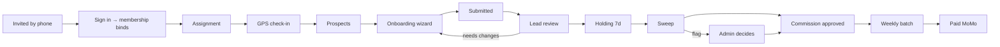

# Field agent journey

| Stage | Agent does | System | Docs |
|---|---|---|---|
| **Invitation** | Lead invites by phone | `fieldops_team_member` invited; `fieldops_bind_invited_memberships` on sign-in with that phone | field-operations/README, team-lead-guide |
| **Login** | Normal Abonten sign-in; "Field work" link appears | `resolveFieldOpsContext` (programme on + worker UI on + membership) | roles-and-permissions |
| **Assignment** | Lead assigns member × territory × dates | `fieldops_assignment` + integrity trigger; notification | working-a-day |
| **Check-in** | Start (GPS for offline) | `start_location`, distance to centre (informational) | working-a-day |
| **Prospects** | Add businesses, log contacts | `fieldops_prospect`, duplicate search `fieldops_find_similar_places` | working-a-day |
| **Onboarding** | Wizard: business → owner OTP/consent link → details → photos + evidence → submit | `fieldops_onboarding`, `phone_otp_state (fieldops-owner)`, `findOrCreateUserByPhone`, `postPlaceCore` under the owner, `fieldops_transition_onboarding`, evidence bucket | onboarding-places, onboarding-organizers-and-events, claim-assistance |
| **Lead review** | Verify / needs changes / reject | `reviewCore`; rule and `holding_until` frozen at verification; pending commission | team-lead-guide |
| **Holding + sweep** | — | `fieldops_run_eligibility_sweep` every 15 min: succeeded → approved; hard fail → rejected; soft/spot check → flagged; release policies for events/claims | earnings-and-payouts, architecture/field-ops |
| **Flag decision** | — | Admin `fieldops_decide_flag` (not the verifier) | admin/field-ops |
| **Payout** | Set MoMo number | `fieldops_build_payout_batch` → second-admin approve → `fieldops_mark_payout_item` paid/failed | earnings-and-payouts |
| **Corrections** | Withdraw / fix; reversals after payment | append-only events; negative offsets | duplicates-and-corrections |
| **Escalation** | Lead → programme manager → founder | announcements, support | conduct-privacy-security |
