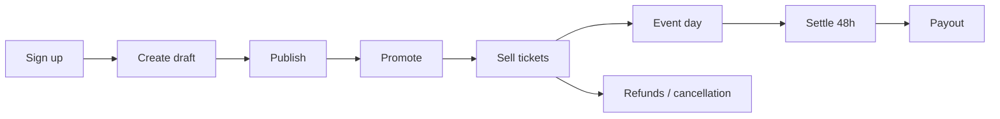

# Organizer journey

| Stage | Organizer does | System | Failure points | Docs |
|---|---|---|---|---|
| **Become an organizer** | Any account; Create (W side menu) or Account › Organizer (A) | Role is derived: `event.organizer_id = auth.uid()`; `useIsOrganizer` shows the Dashboard link once an event exists | — | help organizers/creating-and-publishing-events |
| **Create → Draft** | Title, category/type, dates/occurrences, venue pin, flyer, ticket types (free/paid, price, quantity), description, tags | `event_drafts`/`drafts` autosave (expiring); `postEventCore` → `create_event` RPC; flyer via signed Cloudinary upload | Upload limits; past date refused | same |
| **Publish** | Publish now or later; edit any time | `event.status = published`; appears in discovery RPCs and matview after refresh | Not appearing (matview 15 min; moderation) | troubleshooting |
| **Promote** | Buy a featuring tier; optionally offer a promoter commission (1–30%) | `event_promotion_checkout` → Paystack → `activateEventPromotion`; `event_promoter_commission` | Restricted/hidden listings not eligible | help organizers/promoting-your-event |
| **Sell** | Promo codes; watch Insights and Dashboard | `promo_code` (+ `times_used` only client-writable); sales via checkout path; `record_organizer_earning` 100% of price; dashboard RPCs `get_organizer_*` | — | help organizers/selling-tickets… |
| **Refunds / cancellation** | Buyer cancels (fee retained) or organizer cancels the event | `cancel_event_and_release_tickets` + `issueRefundCore` per transaction; notifications + emails | Refund failed → buyer Retry; finance re-runs | help organizers/cancelling-an-event; finance refunds |
| **Event day** | Attendee list; check-in from list (W/A) or QR scan (A) | `checkInTicketCore` ticket → used | Already used; no signal | help organizers/event-day-check-in |
| **Settle** | Wait 48 h after the last occurrence | `is_event_settled`; pending → available | — | finance settlement |
| **Payout** | Add payout account; request payout | `request_organizer_payout` → `payout` processing + `payout_hold`; review hold if credit share > 20% or dispute | Balance stale; review required | help organizers/finance…; finance settlement |
| **Get paid** | Receives bank/MoMo transfer; sees `completed` | Finance admin settles (`admin_settle_payout`); notification | Delay (no committed SLA — decision F1) | admin/finance |
| **Rewards** (when live) | Monthly rebate as promotion credit; promoter commissions charged as cash | `rewards_run_monthly_rebates`; `promoter_commission` ledger entries | — | finance credit-tender |
| **Reviews** | Reply once to each attendee review | `respondToEventReview` (`event_review.organizer_response`) | Reply cleared by moderation | help organizers |
| **Data duty** | Uses attendee contacts only for the event | `get_event_attendee_contacts` (organizer-scoped) | Misuse → Terms breach | Terms §8 |
