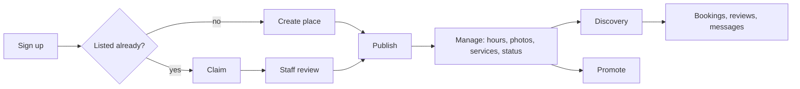

# Place owner journey

| Stage | Owner does | System | Failure points | Docs |
|---|---|---|---|---|
| **Sign up** | Any method | `user_info`; owner role derived from `place.owner_id` | — | help getting-started |
| **Create place** | Name, category, pin, contact, hours, services, photos; draft autosave; publish | `place_drafts`; `postPlaceCore` → `create_place`; `place_opening_hours`, `place_service`, `place_photo` | Duplicate of an existing listing | help place-owners/managing-your-place |
| **Claim** (already listed) | Claim this place; note, contact, documents | `place_claim_request` (one pending per place/claimant); documents in private bucket | Rejected → new claim | help place-owners/claiming… |
| **Staff review** | — | Admin › Claims: `approve_place_claim` transfers `owner_id`, sets claimed+verified; documents purged after 30 days | Disputed claims | admin/claims |
| **Field-team onboarding** (alternative) | Gives OTP/consent to a team member | Listing created under the owner via `postPlaceCore`; owner signs in with the same phone | — | field-operations/onboarding-places |
| **Manage** | Edit details, photos (reorder, cover), hours, services, temporary/permanent closure; insights | `updatePlaceCore`, `placePhotoCore`, `placeHoursStatusCore`, `placeServiceCore`; `place_analytics_event` | Media upload limits | help managing-your-place |
| **Discovery** | Appears in Explore/search/map; open-now badge | `get_filtered_places`, `get_nearby_places`; `computePlaceOpenStatus` | Hidden/restricted | troubleshooting |
| **Bookings** | Accept/decline requests | `place_booking` + notifications | — | help bookings-reviews-and-messaging |
| **Reviews** | Reply once; report abusive | `place_review.owner_response`; reports | Reply cleared | same |
| **Messages** | Business filter in inbox | messaging RPCs | — | same |
| **Promote** | Featuring tier | `place_promotion_checkout` → `activatePlacePromotion` | Not eligible if restricted | help promoting-your-place |
| **Rewards** (when live) | Venue rebate as promotion credit; visit QR | `venue_rebate`, `place_visit_record` | — | finance credit-tender |
| **Ownership security** | Only `approve_place_claim` can move ownership; `verified`/`claimed` trigger-guarded | `guard_staff_managed_columns` | — | security/database-security |
