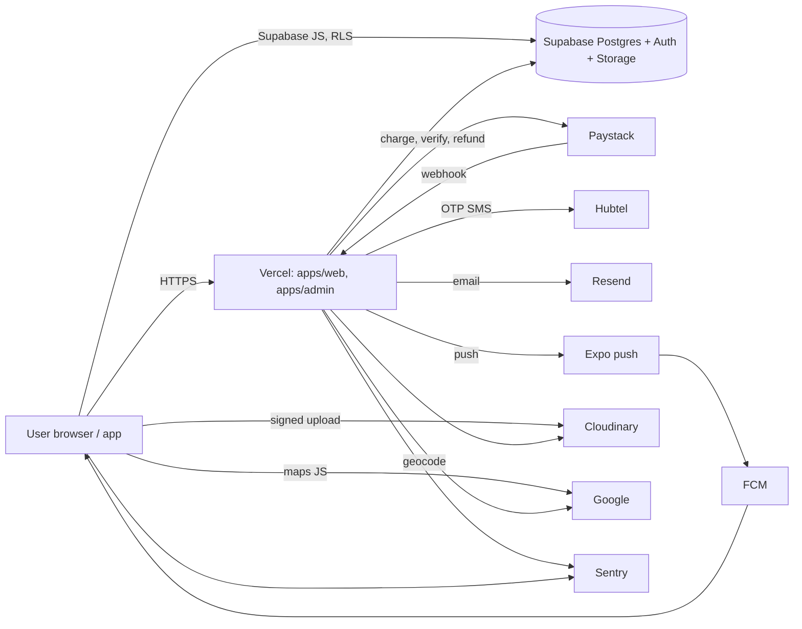

# Third-party processors and sub-processors

| Provider | Role | Personal data it receives | Region (as configured) | Basis / contract | Code reference |
|---|---|---|---|---|---|
| **Supabase** | Database, Auth, Storage, cron | Everything in the data inventory | EU — Paris (project region; Vercel pinned to `cdg1` to match) | Supabase Terms + DPA (confirm signed) | `src/config/supabase/*`, `packages/services/src/supabase/*` |
| **Vercel** | Hosting for web and admin, server functions, edge middleware, request logs | Request metadata, IPs, everything passing through server actions | `cdg1` (Paris) per `vercel.json` | Vercel Terms + DPA (confirm) | `apps/web/vercel.json`, `apps/admin/vercel.json` |
| **Cloudinary** | Media storage and delivery | Avatars, flyers, place photos, highlights, message attachments, ticket QR images (public ids in DB) | Global CDN; account region: confirm | Cloudinary Terms (confirm DPA) | `uploadToCloudinary.ts`, `cloudinaryUploadSignature.ts`, `sendPushNotification`-adjacent QR upload in `generateTicket.ts` |
| **Paystack** | Payments, card tokenization, refunds, (transfers — flag off), disputes | Payer email, amount, currency, card/MoMo details entered in Paystack UI, authorization codes; payout account details if transfers are enabled | Nigeria/Ghana | Paystack merchant agreement | `packages/services/src/payments/gateway/paystackService.ts`, `paystackTransfer.ts`, `api/paystack/webhook/route.ts` |
| **Hubtel** | SMS one-time codes | Phone numbers, the code | Ghana | Hubtel agreement | `packages/services/src/profile/hubtelOtpClient.ts` |
| **Resend** | Transactional email; intended custom SMTP for Supabase Auth emails | Email addresses, ticket content (event, ticket codes, amounts), reward notices, sign-in codes | US | Resend Terms + DPA (confirm) | `ticketPurchaseNotification.ts`, `eventCancellationNotification.ts`, `sendRewardUpdateEmail.ts`; Supabase Auth SMTP setting |
| **Google** | Sign-in (via Supabase Auth), Maps JS, Geocoding API, Play install referrer | Google account identity; approximate location/addresses geocoded; map usage on client | Global | Google APIs Terms | `GoogleAuthButton.tsx`, `/api/geocode`, `geocodeServerSide.ts`, `inviteCapture.ts` |
| **Google Workspace** (since 2026-09-12) | Hosts the support@, privacy@ and security@abontenhub.com mailboxes (aliases on the founder's account) | Whatever people write to us: names, account emails, request details, attachments | Global | Google Workspace Terms | `packages/core/src/brand/contacts.ts`; procedure in `../operations/account-and-support-procedures.md` §Email channels; no retention job (mailbox hygiene is manual) |
| **Firebase (FCM)** | Android push transport under Expo | Device push tokens (Expo-managed) | Global | Firebase Terms | `apps/mobile/google-services.json` (tracked client config) |
| **Expo (EAS)** | Push delivery (`exp.host`), builds, updates | Expo push tokens, notification content (title/body/link data) | US | Expo Terms | `packages/services/src/notifications/sendPushNotification.ts` |
| **Sentry** | Error monitoring for web, admin, mobile | Error events: stack, URL/screen, user id, admin role keys; `sendDefaultPii:false`; cookies/headers/tokens scrubbed in admin `beforeSend` | US (sentry.io) | Sentry Terms + DPA (confirm) | `instrumentation-client.ts`, `apps/admin/src/lib/sentry.ts`, `apps/mobile/src/lib/sentry.ts` |
| **GitHub** | Source control, CI | No user data (secrets as CI secrets) | US | GitHub Terms | `.github/workflows/*` |

## Sub-processor confirmations required (legal B2)

For each provider marked "confirm": obtain and file the signed DPA / terms, note the data-processing region, and confirm the cross-border transfer mechanism accepted under Act 843. Record here when done.

## Providers that do **not** receive data

Twilio (dependency removed; no code path), Flutterwave (never integrated), NextAuth (env vars vestigial — `NEXTAUTH_*` unused), any analytics or advertising network.

## Data flow summary

